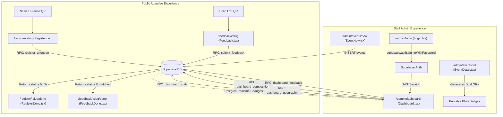

# HACSA Sankofa Insights — Backend Engineering Handoff

**Project Name:** HACSA Sankofa Insights  
**Client:** Heritage and Cultural Society of Africa (HACSA Foundation)  
**Frontend Stack:** React 18, Vite, TypeScript, Tailwind CSS v4, Lucide Icons, Recharts, qrcode.react, Supabase JS Client v2  
**Target Environment:** Node.js v20+, Supabase PostgreSQL  

---

## 1. Executive Summary

This document serves as the complete technical interface contract and handoff guide from the frontend team to the backend/database team. It covers:
1. All database tables and schema expectations.
2. Exact signatures for all stored procedures (PostgreSQL functions / Supabase RPCs).
3. Payload definitions, validation rules, and return types.
4. Realtime subscription triggers and publication settings.
5. Row Level Security (RLS) requirements.
6. Authentication & staff user provisioning.

---

## 2. Architecture & Data Flow Overview



---

## 3. Database Schema Contract

### 3.1 `events` Table
Stores all conferences, galas, and heritage summits.

| Column | Type | Constraints | Description |
|---|---|---|---|
| `id` | `uuid` | Primary Key, `default gen_random_uuid()` | Unique event ID |
| `title` | `text` | `NOT NULL` | Full event title |
| `slug` | `text` | `NOT NULL, UNIQUE` | Clean URL slug (e.g. `sankofa-summit-2026`) |
| `location` | `text` | `NOT NULL` | Venue & City (e.g. `Accra, Ghana`) |
| `event_date` | `date` / `timestamptz` | `NOT NULL` | Scheduled date of event |
| `description` | `text` | `NULLABLE` | Event summary |
| `is_published` | `boolean` | `DEFAULT true` | Only published events are visible to the public |
| `created_at` | `timestamptz` | `DEFAULT now()` | Creation timestamp |

### 3.2 `people` Table
Stores unique individuals identified by their normalized email address.

| Column | Type | Constraints | Description |
|---|---|---|---|
| `id` | `uuid` | Primary Key, `default gen_random_uuid()` | Unique person ID |
| `email` | `text` | `NOT NULL, UNIQUE` | Normalized lowercase email address |
| `full_name` | `text` | `NOT NULL` | Attendee's full name |
| `current_country` | `text` | `NOT NULL` | Country of residence |
| `heritage_country` | `text` | `NULLABLE` | Country of heritage/roots |
| `industry` | `text` | `NOT NULL` | Professional sector |
| `occupation_status`| `text` | `NOT NULL` | Occupation status |
| `organization` | `text` | `NULLABLE` | Company or institution name |
| `created_at` | `timestamptz` | `DEFAULT now()` | Creation timestamp |

### 3.3 `registrations` Table
Represents an attendee checking into a specific event.

| Column | Type | Constraints | Description |
|---|---|---|---|
| `id` | `uuid` | Primary Key, `default gen_random_uuid()` | Unique check-in record |
| `event_id` | `uuid` | `REFERENCES events(id) ON DELETE CASCADE` | Associated event |
| `person_id` | `uuid` | `REFERENCES people(id) ON DELETE RESTRICT` | Associated person |
| `consent_data` | `boolean` | `NOT NULL, DEFAULT true` | Mandatory GDPR/data consent |
| `consent_marketing`| `boolean` | `DEFAULT false` | Optional marketing opt-in |
| `created_at` | `timestamptz` | `DEFAULT now()` | Timestamp of check-in |

> **Unique Constraint:** `(event_id, person_id)` must be unique to prevent duplicate check-ins for the same event.

### 3.4 `feedback` Table
Stores post-event sentiment and ratings.

| Column | Type | Constraints | Description |
|---|---|---|---|
| `id` | `uuid` | Primary Key, `default gen_random_uuid()` | Feedback entry ID |
| `event_id` | `uuid` | `REFERENCES events(id) ON DELETE CASCADE` | Associated event |
| `person_id` | `uuid` | `NULLABLE, REFERENCES people(id)` | Linked if email matched a registration |
| `email` | `text` | `NOT NULL` | Submitted email address |
| `rating` | `integer` | `CHECK (rating >= 1 AND rating <= 5)` | 1 to 5 star rating |
| `what_stood_out` | `text` | `NULLABLE, MAX 500 chars` | Qualitative highlight |
| `what_to_improve`| `text` | `NULLABLE, MAX 500 chars` | Qualitative suggestion |
| `created_at` | `timestamptz` | `DEFAULT now()` | Timestamp of submission |

---

## 4. Stored Procedures (RPCs) Specification

The frontend interacts with the database primarily via `supabase.rpc()`. All backend functions must adhere to the following signatures and return types.

---

### 4.1 `register_attendee`

Handles atomic check-in: deduplicates or updates the person in `people`, and records check-in in `registrations`.

#### Frontend Call:
```typescript
const { data, error } = await supabase.rpc('register_attendee', {
  p_event_slug: string,
  p_full_name: string,
  p_email: string,           // lowercased and trimmed
  p_current_country: string,
  p_heritage_country: string | null,
  p_industry: string,
  p_occupation_status: string,
  p_organization: string | null,
  p_consent_data: boolean,
  p_consent_marketing: boolean,
});
```

#### Expected JSON Return:
```json
{
  "status": "registered" | "already_registered",
  "person_id": "550e8400-e29b-41d4-a716-446655440000",
  "registration_id": "7b8e9221-a3f1-46d2-965a-83b3e6c64111"
}
```

*Status Handling:*
- `"registered"`: Newly inserted check-in.
- `"already_registered"`: Email had already checked into this specific event slug.

---

### 4.2 `submit_feedback`

Accepts feedback from exit QR scans. Resolves `person_id` if email matches an attendee, but accepts and records feedback even if the email was unlinked/unregistered.

#### Frontend Call:
```typescript
const { data, error } = await supabase.rpc('submit_feedback', {
  p_event_slug: string,
  p_email: string,           // lowercased and trimmed
  p_rating: number,          // 1 to 5
  p_what_stood_out: string | null,
  p_what_to_improve: string | null,
});
```

#### Expected JSON Return:
```json
{
  "status": "submitted" | "already_submitted",
  "matched": true | false
}
```

*Status Handling:*
- `"submitted"`: Feedback recorded successfully.
- `"already_submitted"`: This email has already submitted feedback for this event.
- `matched`: `true` if `person_id` was matched, `false` if unlinked attendee.

---

### 4.3 `dashboard_stats`

Retrieves headline KPIs for the dashboard. If `p_event_id` is `null`, aggregates across all published events.

#### Frontend Call:
```typescript
const { data, error } = await supabase.rpc('dashboard_stats', {
  p_event_id: string | null,
});
```

#### Expected JSON Return:
```json
{
  "total_registrations": 482,
  "unique_people": 415,
  "feedback_responses": 168,
  "response_rate": 35,
  "average_rating": 4.6
}
```

---

### 4.4 `dashboard_geography`

Classifies attendees into 3 demographic categories (`local_ghana`, `continental_africa`, `diaspora`) and lists the top countries.

#### Frontend Call:
```typescript
const { data, error } = await supabase.rpc('dashboard_geography', {
  p_event_id: string | null,
});
```

#### Expected JSON Return:
```json
{
  "regions": [
    { "region_type": "local_ghana", "count": 210, "percentage": 44 },
    { "region_type": "diaspora", "count": 182, "percentage": 38 },
    { "region_type": "continental_africa", "count": 90, "percentage": 18 }
  ],
  "countries": [
    { "country": "Ghana", "count": 210 },
    { "country": "United Kingdom", "count": 78 },
    { "country": "United States", "count": 64 },
    { "country": "Nigeria", "count": 42 },
    { "country": "Canada", "count": 28 },
    { "country": "Kenya", "count": 18 },
    { "country": "Jamaica", "count": 14 },
    { "country": "South Africa", "count": 12 }
  ]
}
```

---

### 4.5 `dashboard_composition`

Returns distributions for Industry sectors and Career status.

#### Frontend Call:
```typescript
const { data, error } = await supabase.rpc('dashboard_composition', {
  p_event_id: string | null,
});
```

#### Expected JSON Return:
```json
{
  "industries": [
    { "label": "Technology & AI", "count": 95 },
    { "label": "Arts & Creative Culture", "count": 82 },
    { "label": "Higher Education & Research", "count": 64 },
    { "label": "Business & Finance", "count": 58 }
  ],
  "occupations": [
    { "label": "Employed (Private Sector)", "count": 180 },
    { "label": "Founder / Entrepreneur", "count": 94 },
    { "label": "Student / Academic", "count": 72 },
    { "label": "Public Service / NGO", "count": 55 }
  ]
}
```

---

### 4.6 `dashboard_feedback`

Provides rating distributions, qualitative comments, and the **Key Strategic Insight**: satisfaction broken down by heritage demographic group.

#### Frontend Call:
```typescript
const { data, error } = await supabase.rpc('dashboard_feedback', {
  p_event_id: string | null,
});
```

#### Expected JSON Return:
```json
{
  "average_rating": 4.6,
  "rating_distribution": [
    { "rating": 5, "count": 102 },
    { "rating": 4, "count": 48 },
    { "rating": 3, "count": 12 },
    { "rating": 2, "count": 4 },
    { "rating": 1, "count": 2 }
  ],
  "rating_by_region": [
    { "region_type": "local_ghana", "avg_rating": 4.8, "count": 76 },
    { "region_type": "diaspora", "avg_rating": 4.7, "count": 62 },
    { "region_type": "continental_africa", "avg_rating": 4.3, "count": 30 }
  ],
  "comments": [
    {
      "region_type": "diaspora",
      "rating": 5,
      "what_stood_out": "The Sankofa dialogue on historical preservation was deeply inspiring.",
      "what_to_improve": "Add more networking time between panels."
    }
  ],
  "matched_count": 168,
  "total_count": 174,
  "unmatched_count": 6
}
```

---

## 5. Realtime Publication Settings

The dashboard listens to changes on Postgres tables to provide instant updates when attendees scan badges at the entrance or complete exit surveys.

### Required Supabase Realtime Setup:
Ensure the following tables are added to the `supabase_realtime` publication:

```sql
ALTER PUBLICATION supabase_realtime ADD TABLE public.people;
ALTER PUBLICATION supabase_realtime ADD TABLE public.registrations;
ALTER PUBLICATION supabase_realtime ADD TABLE public.feedback;
```

### Frontend Subscription Pattern:
```typescript
supabase
  .channel('dashboard-realtime')
  .on('postgres_changes', { event: 'INSERT', schema: 'public', table: 'people' }, () => refresh())
  .on('postgres_changes', { event: 'INSERT', schema: 'public', table: 'registrations' }, () => refresh())
  .on('postgres_changes', { event: 'INSERT', schema: 'public', table: 'feedback' }, () => refresh())
  .subscribe();
```
*(Note: The frontend includes a fallback 10-second polling mechanism in case WebSocket connection is blocked by venue firewalls).*

---

## 6. Row Level Security (RLS) Policies

To protect attendee privacy while allowing public check-ins:

1. **`events` table**:
   - `SELECT`: Public access for published events (`WHERE is_published = true`).
   - `INSERT / UPDATE / DELETE`: Authenticated staff users only (`auth.role() = 'authenticated'`).

2. **`people` & `registrations` tables**:
   - `SELECT`: Authenticated staff only (`auth.role() = 'authenticated'`).
   - `INSERT`: Executed via `SECURITY DEFINER` stored procedure (`register_attendee`). Public direct `INSERT` can be revoked.

3. **`feedback` table**:
   - `SELECT`: Authenticated staff only (`auth.role() = 'authenticated'`).
   - `INSERT`: Executed via `SECURITY DEFINER` stored procedure (`submit_feedback`).

4. **Dashboard RPCs**:
   - All `dashboard_*` RPC functions must be marked `SECURITY DEFINER` or restricted to authenticated staff (`auth.role() = 'authenticated'`).

---

## 7. Staff Authentication & Admin Users

- **Auth Engine**: Supabase Auth (Email + Password).
- **Staff Provisioning**:
  - Staff accounts are managed via the Supabase Auth dashboard (`Authentication > Users`).
  - New staff accounts must have **"Auto Confirm User"** set to `true` (or email confirmation completed) to permit login.
- **Frontend Behavior**:
  - Unauthenticated visits to `/admin/*` are intercepted by `ProtectedRoute.tsx` and redirected to `/admin/login`.
  - Session state persists via `localStorage` and listens to `supabase.auth.onAuthStateChange`.

---

## 8. Environment Variables Required

The frontend expects the following keys in `.env.local` (local) and in hosting provider settings (e.g. Vercel, Netlify, Cloudflare Pages):

```bash
VITE_SUPABASE_URL=https://<your-project-ref>.supabase.co
VITE_SUPABASE_ANON_KEY=<your-public-anon-jwt>
```

> **Security Note:** The `ANON_KEY` is public by design. Security is enforced through Row Level Security (RLS) policies and RPC definitions on PostgreSQL.

---

## 9. Backend Engineer Checklist

- [ ] Verify `events`, `people`, `registrations`, and `feedback` tables match foreign keys and constraints.
- [ ] Deploy the 6 stored procedures (`register_attendee`, `submit_feedback`, `dashboard_stats`, `dashboard_geography`, `dashboard_composition`, `dashboard_feedback`).
- [ ] Confirm `supabase_realtime` publication includes `people`, `registrations`, and `feedback`.
- [ ] Verify RLS policies are enabled on all 4 tables.
- [ ] Create at least one staff user with confirmed email in `auth.users`.
- [ ] Test sample execution of `register_attendee` and ensure duplicate email check-in returns `"already_registered"`.
